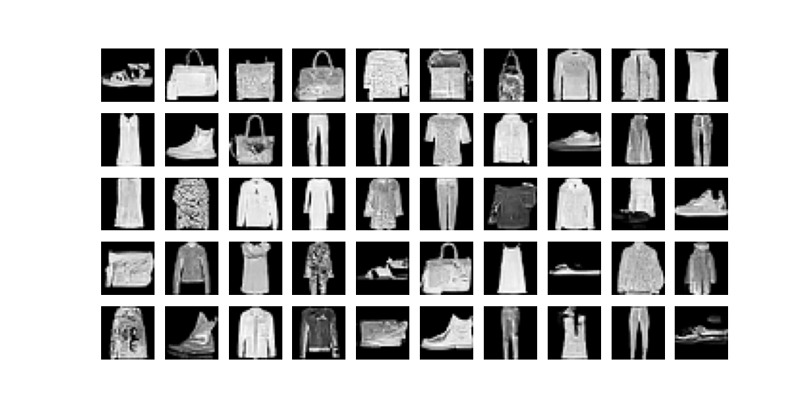
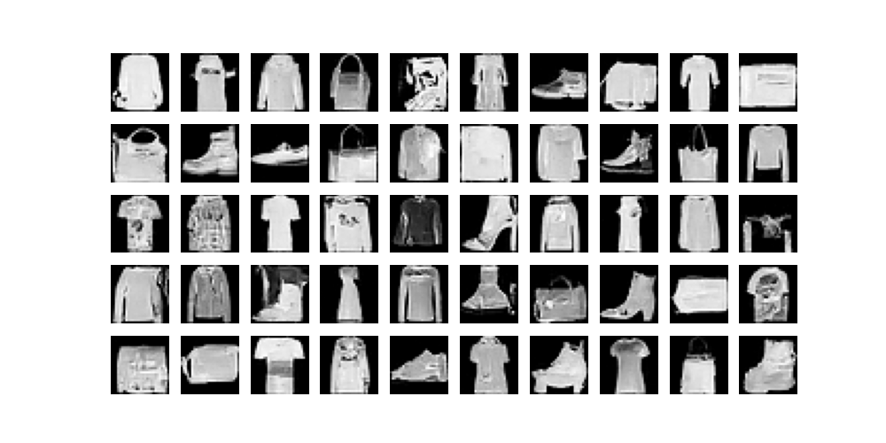

# Denoising Diffusion Implicit Models (DDIMs)
- Title: Denoising Diffusion Implicit Models
- Author: Jiaming Song, Chenlin Meng & Stefano Ermon
- Conf: ICLR 2021
- URL: [Arxiv](https://arxiv.org/pdf/2010.02502)

## Summary of the Paper
The paper presents Denoising Diffusion Implicit Models (DDIMs), an advancement over Denoising Diffusion Probabilistic Models (DDPMs) for image generation. DDIMs maintain the same training procedure as DDPMs but introduce non-Markovian diffusion processes, enabling faster sampling and producing high-quality images. DDIMs can generate samples 10× to 50× faster than DDPMs, offering a trade-off between computation and sample quality. Additionally, DDIMs support semantically meaningful image interpolation and accurate observation reconstruction. The study highlights DDIMs' efficiency and potential for further enhancements using advanced ODE discretization methods.

## What I implemented
- Both DDPM and DDIM Diffuser from scratch.
  - I defined the Diffuser class of DDPM first and implemented DDIM by inheriting that class.
- Implemented evaluation by FID.

## Setup
```
cd DDIM
pip install -r requirements.txt
DDIM.py
```


## Experiments
### Device
NVIDIA RTX A3000 8GB

## Hyperparameters
- Diffusion Steps: 1000
- Noise Schedule: $\beta_{\text{start}}=0.0001, \beta_{\text{end}}=0.02$, linear interpolation
- Learning Rate: 1e-3
- Batch Size: 128

## Result

<div style="text-align:center"></div>

<div style="text-align:center"></div>

## Reference
